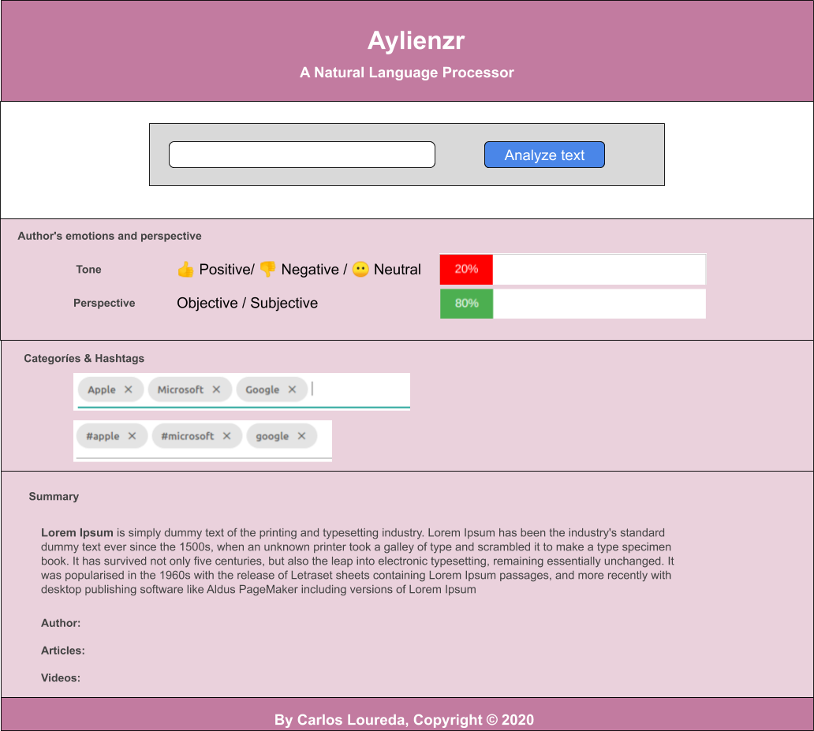
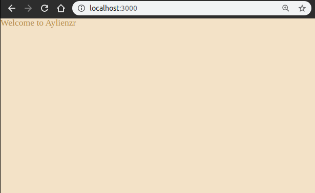

# AYLIEN

- JS-SDK: https://docs.aylien.com/textapi/sdks/#node-js-sdk
- On src/server/

```bash
yarn add aylien_textapi
```

- Install dotenv

```bash
yarn add dotenv
```

Create .env enviroment

## Allowing ES&6 imports

I want to move all related API code to the `/api/` folder so what I am going to do is intall babel but try to install it with webpack so I can use that. This means I need to have a webpack config for server and client, lets start with server by now :D

```
yarn add -D @babel/core @babel/preset-env
yarn add -D babel-loader
```

Also I set the `webpack.dev.js` file and the .babelrc`

I am having problems with .env and webpack :D, this might help: https://stackoverflow.com/questions/46224986/how-to-pass-env-file-variables-to-webpack-config

The problem was that .env needs to be on the complete route of the project not inside the server

> I did this on branch `server-webpack`

This might not be needed later but as I began with server (from clean project)
I wanted to test if I could use ES6 imports/exports.

I will use require from now on, just wanted to test webpack without copy&pasting

## API Endpoints

Here we have the [documentation](https://docs.aylien.com/textapi/endpoints/#http-request)

Added tests for **classification**, **sentiment**, **language detection**, **article extraction**, **summarization**

Interesting for the future: **Concept Extraction**, **Entity Extraction**,**Taxonomies**, **Entity Level Sentiment Analysis**, **Aspect-Based Sentiment Analysis**,

Not used by now: **Image Tagging**, **Hashtag Suggestion** and **Combined Calls**

# UI - Desgin

I make a break on the server work and I want to create the HTML & CSS for the UI at a static level, I will try to make SASS work to build an static HTML using webpack and later will comeback to this when the server is ready to join the pieces together.



## SASS

As I want to use SASS we need to have weback involved:

```bash
yarn add -D style-loader node-sass css-loader sass-loader
```

- I need to install also the HtmlWebPackPlugin to also serve the HTML files

```bash
yarn add -D html-webpack-plugin
```

Now running:

```bash
# on root
yarn run build-dev
node src/server/index.html
```

We should see something like this:


`branch: ui-design`
`commit: 5a927fb9450bbecaaa542fdcc2cc9686037550de`

## Let's add convinience features

```
yarn add -D webpack-dev-server
```

So now the run script instead of this:

```json
    "build-dev": "webpack --config webpack.dev.js"
```

Will be:

```json
    "build-dev": "webpack-dev-server --config webpack.dev.js --open"
```

For not removing each time the `dist` folder like this:

```json
rm -rf dist && webpack-dev-server  --config webpack.dev.js --open
```

We install `webpack-dev-server`

```
yarn add -D clean-webpack-plugin
```

```
const { CleanWebpackPlugin } = require('clean-webpack-plugin');
```

We can run it without config:

```
    new CleanWebpackPlugin()
```

# UI

Branch: `ui-design`

For having `webpack-dev-server` hot-reload I need to indicate `target: 'web'` instead of node.
As I want to use font-awesome to add some emojis I have to add it now as a development dependcy and import it on the index.js file: https://fontawesome.com/how-to-use/on-the-web/setup/using-package-managers#installing-free

For adding progress bar: https://css-tricks.com/html5-progress-element/

# All together

Here comes the heavy lifting. Now the frontend will query the backend for some responses.
Let's go!

> Added tone of stuff

## Preparing production

### Install service workers

- Install the plugin: `yarn add -D workbox-webpack-plugin`
- Require the plugin in prod: `const WorkboxPlugin = require('workbox-webpack-plugin');`
- Add the plugin: `new WorkboxPlugin.GenerateSW()`

We need to register a Service Worker with our app. To do this, we will add a script to our html file and call the register service worker function if the browser supports service workers.

Add this code to the bottom of your html file, just above the closing body tag.

```html
<script>
  // Check that service workers are supported
  if ("serviceWorker" in navigator) {
    // Use the window load event to keep the page load performant
    window.addEventListener("load", () => {
      navigator.serviceWorker.register("/service-worker.js");
    });
  }
</script>
```

I did some enviroment checking to do this only on production, now I need to work on production configuration.

I will follow this [guide](https://webpack.js.org/guides/production/)

- [TenserWebpackPlugin](https://webpack.js.org/plugins/terser-webpack-plugin/)

```js
yarn add -D terser-webpack-plugin
```

- [MiniCssExtractPlugin](https://webpack.js.org/plugins/mini-css-extract-plugin/#minimizing-for-production)

```js
yarn add -D mini-css-extract-plugin
```

To minify the output, use a plugin like optimize-css-assets-webpack-plugin. Setting optimization.minimizer overrides the defaults provided by webpack, so make sure to also specify a JS minimizer:

```js
yarn add -D optimize-css-assets-webpack-plugin
```

I have several warnings on the webpack build, but I want to try to deploy the app to production first
